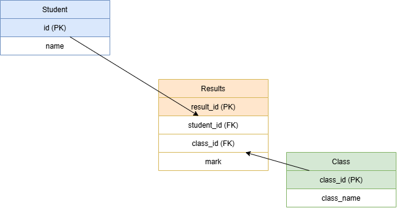

# My-SQl-Projects
This repository contains SQL projects showcasing my skills in writing queries, joins, aggregations, and data analysis. Created as part of my learning journey into data and technology.
## Student Results Database Design

This project illustrates a simple relational database schema for managing student results.  
It includes three tables — **Student**, **Class**, and **Results** — connected through primary and foreign keys.

### Skills Demonstrated
- Database design and ER modelling  
- Understanding PK/FK relationships  
- Logical data structuring  
- Diagram creation using Draw.io  

### Tables
- Student(id, name)
- Class(class_id, class_name)
- Results(result_id, student_id, class_id, mark)

----------------------------------------------------------------------------------------------------------------------------
## 🗄️ SQL Data Analysis Projects

A collection of SQL projects completed as part of my **Data Technician Bootcamp**, showcasing database design and query-writing skills applied to retail and sales data scenarios.

## 🧰 Skills Demonstrated

### Core Querying
- **SELECT / SELECT DISTINCT** – retrieving specific columns and unique values from tables
- **WHERE** – filtering records based on single and multiple conditions (e.g. category, date range, boolean flags)
- **ORDER BY** – sorting results in ascending/descending order to surface top and bottom values
- **GROUP BY** – aggregating data by category (e.g. summarising records per country, product, or customer group)
- **HAVING** – filtering aggregated results (e.g. groups with counts or totals above a threshold)
- **BETWEEN / LIKE** – range-based and pattern-based filtering of records

### Aggregation & Functions
- **COUNT, SUM, MAX, AVG** – calculating totals, counts, and averages across grouped data
- Combining aggregate functions with `GROUP BY` and `ORDER BY` to rank and compare results

### JOINs & Relational Design
- Understanding and applying different types of **table JOINs** to combine related data across multiple tables
- Designing a relational **database schema** for a retail business, including:
  - **Inventory**, **Sales**, **Customer**, and **Loyalty** tables
  - Defining **Primary Keys (PK)** and **Foreign Keys (FK)** to establish relationships between tables
- Writing SQL statements to **CREATE** tables and **INSERT** initial data

### Subqueries
- Using nested subqueries to filter results against calculated values (e.g. records above the overall average, or the maximum value within a group)

## 📁 Project Context
- Designed a relational database structure for a small retail business (inventory, sales, customer, and loyalty data)
- Practised writing and debugging SQL queries against a real dataset using **PostgreSQL (via Supabase)**
- Used queries to extract insights such as top categories, records within a range, and grouped summaries — the same querying logic used to analyse retail and sales data

## 🎯 Purpose
These projects were built to strengthen core SQL skills relevant to a **Data Technician** role — from designing efficient relational databases to writing queries that extract clear, actionable insights from structured data.

---
*Part of my ongoing journey transitioning into a career in data and technology.*
